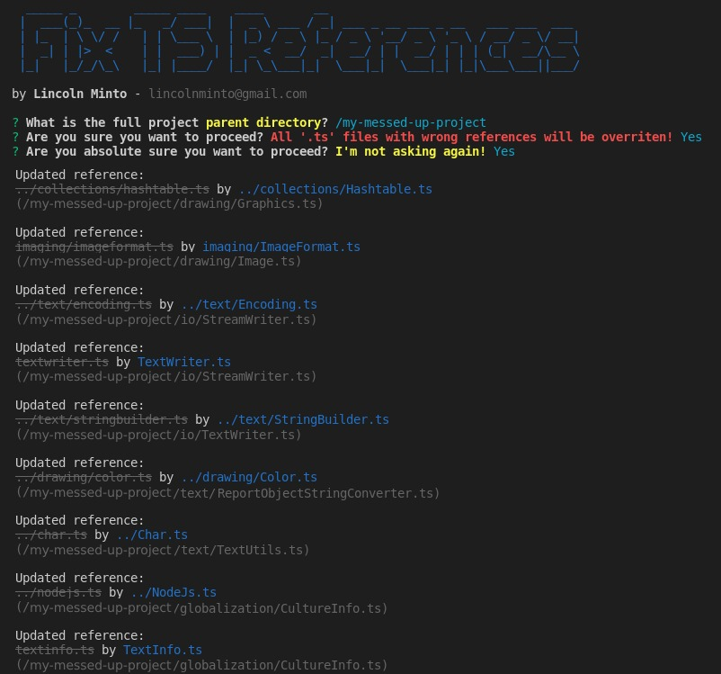

# Fix Typescript References

***fix-ts-references*** is fix tool created to fix imported TypeScript references in non case-sensitive file-systems. 

## Install

    npm install -g @lincolnminto/fix-ts-references

## Usage
```
fix-ts-references
```
or
```
npx @lincolnminto/fix-ts-references
```

## Example




